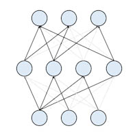

# CSDT: Sparse Deep Neural Network Toolkit
     

## Introduction

**CSLT Sparse DNN Tookit (CSDT)** is a toolkit for implementation and exploration of sparse deep neural networks in speech recogniton. It's built on [Kaldi](https://github.com/kaldi-asr/kaldi) Speech Recognition Toolkit and it's released for further research on sparse deep neural networks.

The toolkit is developed by Yanqing Wang, supervised by Dong Wang, at Center for Speech and Language Technologies, Research Institute of Information Technology, Tsinghua University.

Please note that the documentations will be pretty helpful for you to use the toolkit correctly.

## Structure

The tookit consists of 5 parts:

**CSLT Connection Sparseness Toolkit (CCST)**: a toolkit for implementation of connection sparseness of deep neural networks in speech recogniton based on Kaldi.

**CSLT Node Sparseness Tookit (CNST)**:  a toolkit for implementation of node sparseness of deep neural networks in speech recognition based on Kaldi.

**CSLT DNN Ensembling Tookit (CDET)**: a toolkit for making an ensemble of four deep neural networks (must in specified format).

**CSLT Exclusive DNN Tookit (CEDT)**: a toolkit for construction of four deep neural networks, whose structures are mutually exclusive and collectively exhaustive.

**Supplement to Kaldi Source Code**: a folder containing source files of commands based on Kaldi ASR toolkit. This Kaldi-based Command will help you to implement sparse deep neural networks based on Kaldi. To use the source files correctly, you should follow 'readme.txt' in that folder.

## Documentation

The introduction and the usage of the toolkit, CSDT, is covered by following three CSLT Technical Report written by Yanqing Wang, Zhiyuan Tang and Dong Wang:

[TRP-20170002: Connection Sparseness in Speech Recognition Based on Kaldi (in Chinese)](http://cslt.riit.tsinghua.edu.cn/mediawiki/images/f/ff/Connection_sparseness.pdf)

[TRP-20170003: Long-term DropConnect in Speech Recognition (in Chinese)](http://10.3.200.202/cache/6/03/cslt.riit.tsinghua.edu.cn/5f6bc01ad0284ac070c1da197baf58c4/Long-term_dropconnect.pdf)

[TRP-20170004: Neural Sparseness in Speech Recognition Based on Kaldi (in Chinese)](http://10.3.200.202/cache/7/03/cslt.riit.tsinghua.edu.cn/76269ae042af12690a916b8fcd698eec/Neural_sparseness.pdf)

You can read them to get aware of our previous work and the detailed information of CSLT Sparse DNN Tookit (CSDT).

## License 
MIT

## Contact

Yanqing Wang (wangyanqingchn@163.com)
